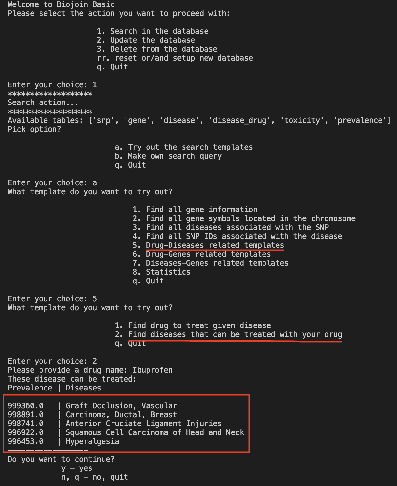

# Biojoin Project 
Course: KAIST Spring 2022, Bio-Information Processing (BiS332) by Prof. Doheon Lee

<!-- TABLE OF CONTENTS -->
<details>
  <summary>Table of Contents</summary>
  <ol>
    <li>
      <a href="#about-the-project">About The Project</a>
      <ul>
        <li><a href="#built-with">Built With</a></li>
      </ul>
    </li>
     <li><a href="#prerequisites">Getting Started</a>
    <li><a href="#getting-started">Getting Started</a>
    </li>
    <li><a href="#usage">Usage</a></li>
    <li><a href="#code">Code review</a></li>
    <li><a href="#contact">Contact</a></li>
  </ol>
</details>

## About The Project
This project is part of the course BiS332. The aim of this project is to develop an integrative bio-information inference system using various biological databases. It consists of two steps: 1. Data extraction and integration and 2. building a software to operate with the data.


## Build with 
This section will list some major frameworks/libraries used
* [Python 3.8.13](https://www.python.org/)
* [psycopg2](https://www.psycopg.org/)
* [pandas](https://pandas.pydata.org/)

## Prerequisites
- postgres database you can access with known credentials

## Getting Started
1. Python installation
   - in case you want different specific python versions and separate isolated environments, I recommend you yo use conda (https://docs.conda.io/en/latest/) 
   - otherwise you can downlaod python with homebrew for Mac or on the official website https://www.python.org/downloads/
2. Repository clone
   - clone this repository by forking it 
3. psycopg2 and pandas
   - install both Python packages with pip one by one
   - alternatively use the requirements.txt file to install all packages at once
```bash
pip install -r /path/to/requirements.txt
```
4. config.json file
   - for the config file you need:
     - host name (db_host)
     - database name (db_name)
     - username for the database (db_user)
     - password for the database (db_pw)
   - port is default = 5432 

## Usage
### Stage 1: Data extraction and integration
Raw data was already provided by the course TAs and can be found in the data/ folder. Only the file merged.txt is generated in the script. 
Insertion of data from txt file into the PostgreSQL database tables.

Make sure you have the data/ folder with disease_OMIM.txt, gene_OMIM.txt, Homo_sapiens_gene_info.txt and SNP.txt files. Furthermore, fill the config.json file to establish the connection to the database.
```bash
python fill.py
```

### Stage 2: Operate with the data
The main file is the cmdline.py. It will launch a command-line interface with that user can search, update and delete entries in the database that is provided in the config.json file. 
```bash
python cmdline.py
```


## Technical Details
### Database structure (DDL)
```sql
CREATE TABLE dbSNP (
  snp_id int NOT NULL,
  snp_chr varchar,
  snp_pos varchar,
  gene_symb varchar,
  anc_allele varchar,
  min_allele varchar,
  PRIMARY KEY (snp_id)
);

CREATE TABLE Gene (
  tax_id varchar,
  gene_id int UNIQUE,
  gene_symb varchar NOT NULL,
  gene_syn varchar,
  gene_chr varchar,
  gene_pos varchar,
  gene_sum text,
  gene_type varchar,
  gene_mod_date date NOT NULL,
  PRIMARY KEY (gene_id)
);


CREATE TABLE OMIM (
  omim_id int,
  omim_name varchar,  
  gene_symb varchar,
  PRIMARY KEY (omim_id, gene_symb)
  );
```
### Database insertion
Data is preprocessed to a format that is the most convenient to insert data with. A dictionary is generated from the txt files to make a object csv and copy into db for best performance. The idea is obtained from copy_stringio() in https://hakibenita.com/fast-load-data-python-postgresql.

merged.txt - gene_OMIM.txt and disease_OMIM.txt are merged with an outer join method on their attribute 'disease_OMIM_ID'.

### Database operation
#### Structure of the program:
- cmdline.py initializes and ends the program
- based on user input a pre_{search/update/delete} function is started to obtain more data from teh user in order to pass it as arguments for the search/update/delete function.
- search/update/delete function construct a SQL query and parse the output from the database
- template_sql.py gives some basic function user can try to test the database (the queries are part of the project exercise)

